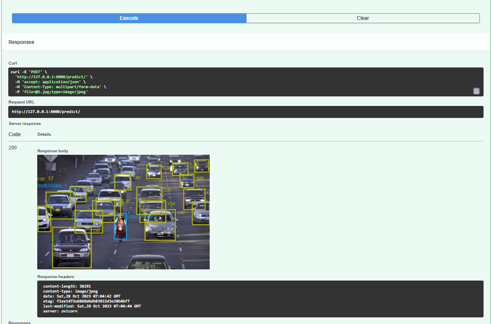
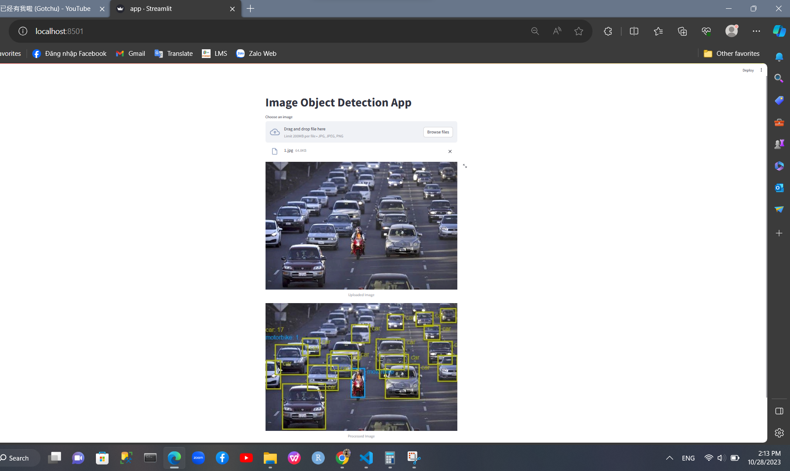

# Project Name
🌟Image Object Detection🌟

## Description
This is a FastAPI-based web service that accepts an image upload and performs object detection on the image using a pre-trained model Yolov5m. It returns the annotated image with the detected objects.


## Installation
1. Clone the repository: 
```bash
git clone hhttps://github.com/DangLeChi/AIE_project.git
```
2. Install project dependencies:
```bash
pip install -r requirements.txt
```
## Features

✨Train the data set in the notebook above with model yolov5-m.✨

✨links: https://github.com/ultralytics/yolov5/blob/master/models/yolov5m.yaml✨

✨Convert model to onnx✨

✨Rewrite inference as streamlit api/app + fastapi using onnx model above

+ Input for dropping 1 image in.
+ Ouput: drawing image with label and counting the number of each object.

## Usage
 ✨Run the FastAPI server:
```bash
uvicorn api:api --port 8000
```

✨ Open your browser and navigate to `http://localhost:8000/docs` to check prediction.

✨ Start the streamlit app:
```bash
streamlit run app.py
```




## Contributing
🤝 Contributions are welcome! Please follow these guidelines when contributing to the project:
1. Fork the repository.
2. Create a new branch: 
```bash
git checkout -b feature/your-feature
```
3. Commit your changes: 
```bash
git commit -m 'Add your feature'
```
4. Push to the branch: 
```bash
git push origin feature/your-feature
```
5. Create a pull request.

## License
📝 This project is open source
